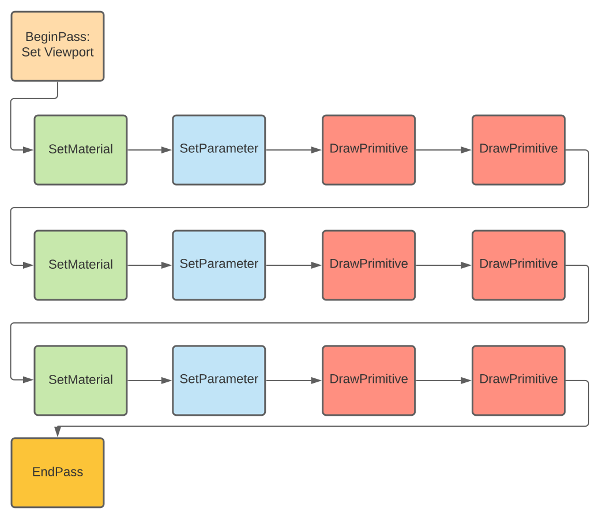

.. _osre_render_system:

Render System
=============

Multithreaded rendering
-----------------------
The rendering will be done in a separate render-thread. 

The Render-Graph
----------------
The rendering is managed by a render-graph:
- In each frame all the passes were iterated
- For each pass all the render-batches will be iterated
  - A batch iteration will set the uniform parameter
  - A batch iteration will set the material
  - A batch iteration will do all render calls.
  
It look like:
  

    

Render-Backend-Service
----------------------
We have a class called the RenderBackend-Service which is the fascade for the user to the render-backend. If you want to create a render 
window or you want to add a new mesh to the scene you have to do this via the RenderBackend-class:
::

    class RenderBackendService {
    public:
        RenderBackendService();
        virtual ~RenderBackendService();
        void setSettings(const Properties::Settings *config, bool moveOwnership);
        const Properties::Settings *getSettings() const;
        void sendEvent(const Common::Event *ev, const Common::EventData *eventData);
        PassData *getPassById(const c8 *id) const;
        PassData *beginPass(const c8 *id);
        RenderBatchData *beginRenderBatch(const c8 *id);
        void setMatrix(...);
        void setUniform(UniformVar *var);
        void setMatrixArray(const String &name, ui32 numMat, const glm::mat4 *matrixArray);
        void addMesh(Mesh *geo, ui32 numInstances);
        void addMesh(const CPPCore::TArray<Mesh *> &geoArray, ui32 numInstances);
        void updateMesh(Mesh *mesh);
        bool endRenderBatch();
        bool endPass();
        void clearPasses();
        void attachView();
        void resize(ui32 x, ui32 y, ui32 w, ui32 h);
        void syncRenderThread();
    };

::

To work with this you have to configure it and open the access to it:

::

       auto *rbService = new RenderBackendService();
       rbService->setSettings(mySettings, false);
       if (!m_rbService->open()) {
           // Error handling
       }
::

Render-API's
============
At this moment the following render-backends are implemented:

* OpenGL
* Vulkan (in progress)
